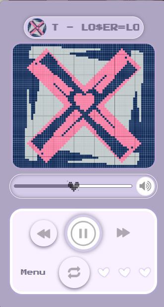
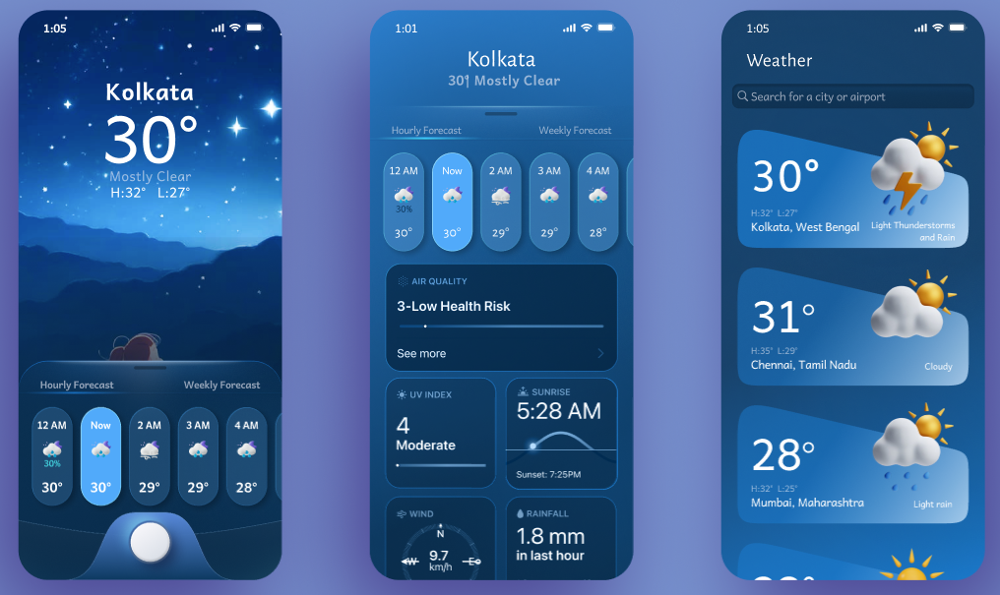
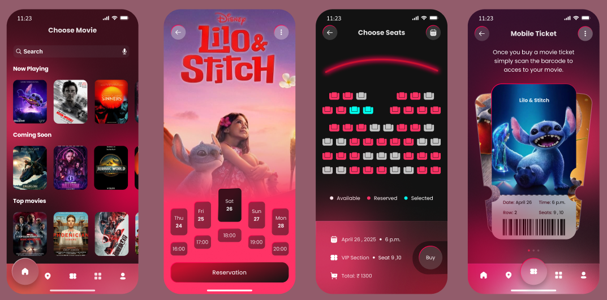

# 👋 Hi, I'm Sristi Dakua!
👩🏻‍💻 A Software Engineering Student sharing about my journey and learnings in tech 
👩🏻‍🎓 Studying Information Technology at Jadavpur University 
🧑‍🎨 Building projects in web dev, open source, and productivity tools 
🌷 #learninginpublic in my [portfolio site](https://sristiverse.netlify.app/) 

 

# 💻 Tech Stack

 

 

# 🚀 Featured Projects

## 🎨 UI Design

